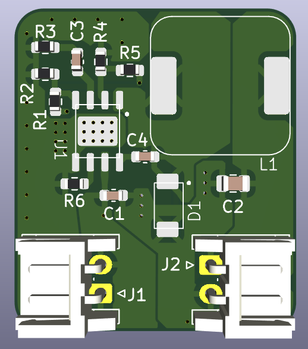
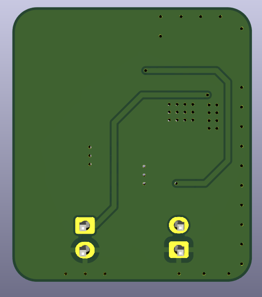

# Buck Step-Down MP1584 - 28V to 5V

Ce projet KiCad implémente un **convertisseur abaisseur (step-down)** basé sur le **MP1584**, permettant de convertir une tension d'entrée allant jusqu'à **28V** en **5V stabilisé** avec un courant de sortie maximal de 3A.

Le PCB a été conçu pour :
- respecter les bonnes pratiques de découpage (zones GND séparées en top, reliées en bottom),
- fournir une alimentation compacte et fiable pour circuits 5V.

---

## 📷 Vues du PCB

### Face top (Top layer)

### Face bottom (Bottom layer)

---

## 📄 Datasheet

La **datasheet du MP1584** est disponible dans le répertoire, sous le nom :

